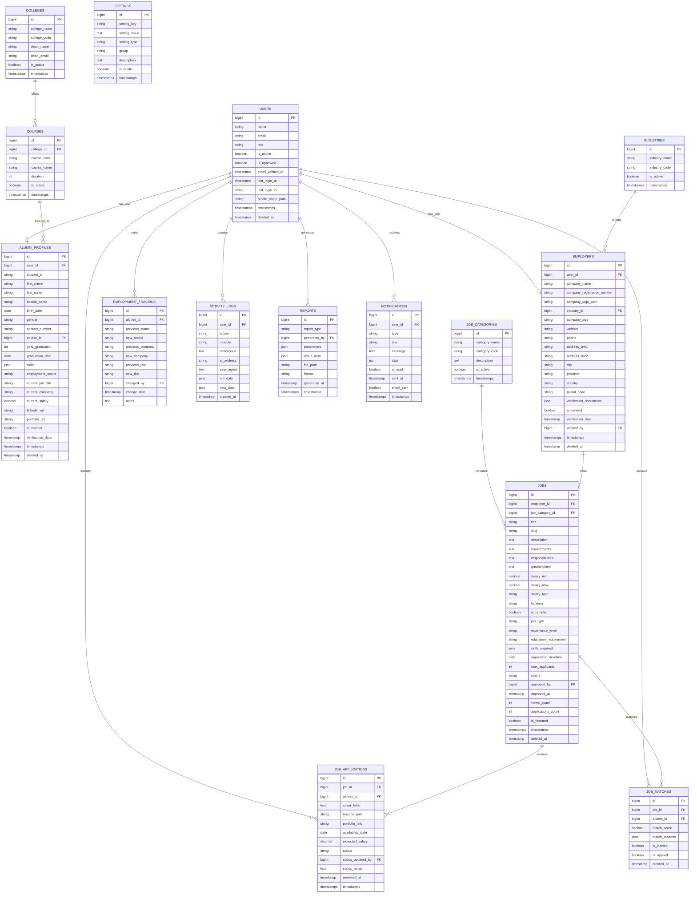

# Alumni Tracking & Job Portal ERD

## Text-Based ERD

```
users
  id PK
  role, is_active, is_approved, email_verified_at
  last_login_at, last_login_ip, profile_photo_path
  -> hasOne alumni_profiles
  -> hasOne employers
  -> hasMany job_applications (as alumni_id)
  -> hasMany job_matches (as alumni_id)
  -> hasMany employment_tracking (as alumni_id)
  -> hasMany activity_logs
  -> hasMany reports (as generated_by)
  -> hasMany notifications

colleges
  id PK
  -> hasMany courses

courses
  id PK
  college_id FK -> colleges.id
  -> hasMany alumni_profiles

alumni_profiles
  id PK
  user_id FK -> users.id
  course_id FK -> courses.id

industries
  id PK
  -> hasMany employers

employers
  id PK
  user_id FK -> users.id
  industry_id FK -> industries.id
  verified_by FK -> users.id
  -> hasMany jobs

job_categories
  id PK
  -> hasMany jobs

jobs
  id PK
  employer_id FK -> employers.id
  job_category_id FK -> job_categories.id
  approved_by FK -> users.id
  -> hasMany job_applications
  -> hasMany job_matches

job_applications
  id PK
  job_id FK -> jobs.id
  alumni_id FK -> users.id
  status_updated_by FK -> users.id
  UNIQUE(job_id, alumni_id)

job_matches
  id PK
  job_id FK -> jobs.id
  alumni_id FK -> users.id
  UNIQUE(job_id, alumni_id)

employment_tracking
  id PK
  alumni_id FK -> users.id
  changed_by FK -> users.id

reports
  id PK
  generated_by FK -> users.id

notifications
  id PK
  user_id FK -> users.id

activity_logs
  id PK
  user_id FK -> users.id

settings
  id PK
```

## Mermaid


